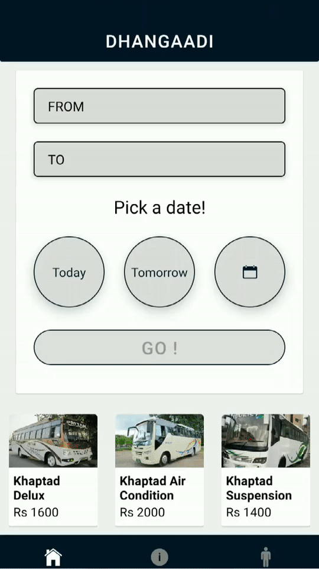

# 🚌 Bus Reservation System

## 📌 Introduction

The **Bus Reservation System** is a simple and efficient application designed to automate the process of booking and managing bus tickets. This system allows users to check reserve seats, cancel bookings, and receive confirmation—all through a user-friendly interface. Administrators can manage buses, schedules, and passenger records with ease.

This project helps reduce the manual workload, improve customer experience, and streamline the entire reservation process.

<p>


</p>

## Demo (Client => NextJS): 


### To run -> 
* #### clone the entire repo
* #### go to server repo
* #### make environment file with the following keys' values:
```
MONGO_URI = "path to mongodb url"
userEmail = "your email"
userPass = "your password"
JWT_SECRET = "your secret here"
```
* #### yarn
* #### yarn server
* #### go to client repo
* #### yarn
* #### yarn dev


## Demo (CRM => React):

### To run -> 
* #### clone the entire repo
* #### go to server repo
* #### make environment file with the following keys' values:
```
MONGO_URI = "path to mongodb url"
userEmail = "your email"
userPass = "your password"
JWT_SECRET = "your secret here"
```
* #### yarn
* #### yarn server
* #### go to CRM repo
* #### make environment file with the following keys' values: 
```
REACT_APP_API_URL = http://localhost:8525/api
REACT_APP_SERVER_ROUTE = http://localhost:8525
REACT_APP_JWT_SECRET = "your secret here"
```
* #### yarn
* #### yarn start

## Demo (Mobile App => React-Native) *Under construction*

### To run -> 
* #### clone the entire repo
* #### go to app repo
* #### yarn
* #### having expo installed in your system, expo start
